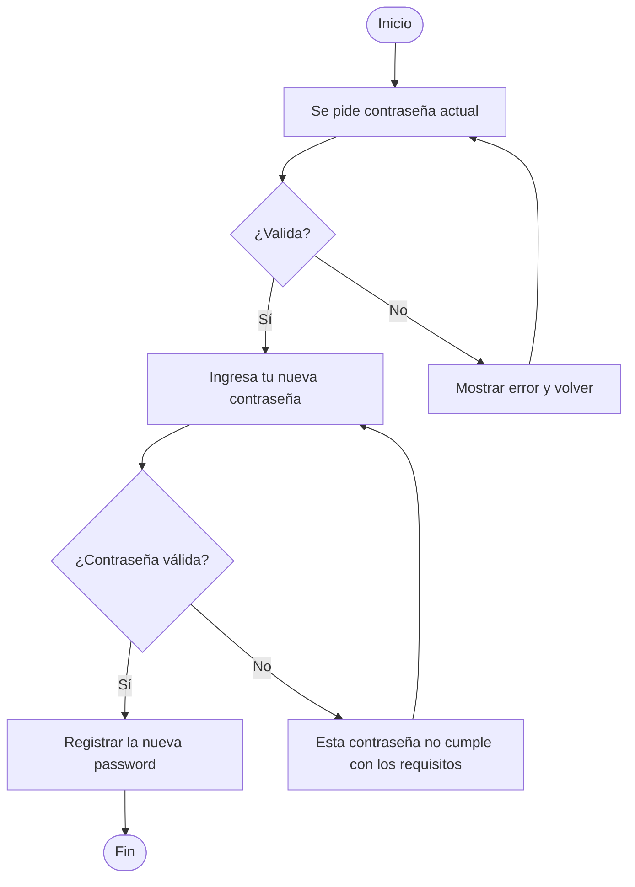

Nota: Cliente ya loguedo
Inicia con set(id,password)

```mermaid
graph TD
    A([Inicio]) --> B[Se pide contraseña actual]
    B --> C{¿Valida?}
    C -->|Sí| D[Ingresa tu nueva contraseña]
    C -->|No| E[Mostrar error y volver]
    E --> B
    D --> F{¿Contraseña válida?}
    F -->|Sí| G[Registrar la nueva password]
    F -->|No| I[Esta contraseña no cumple con los requisitos]
    I --> D
    G --> H([Fin])
```