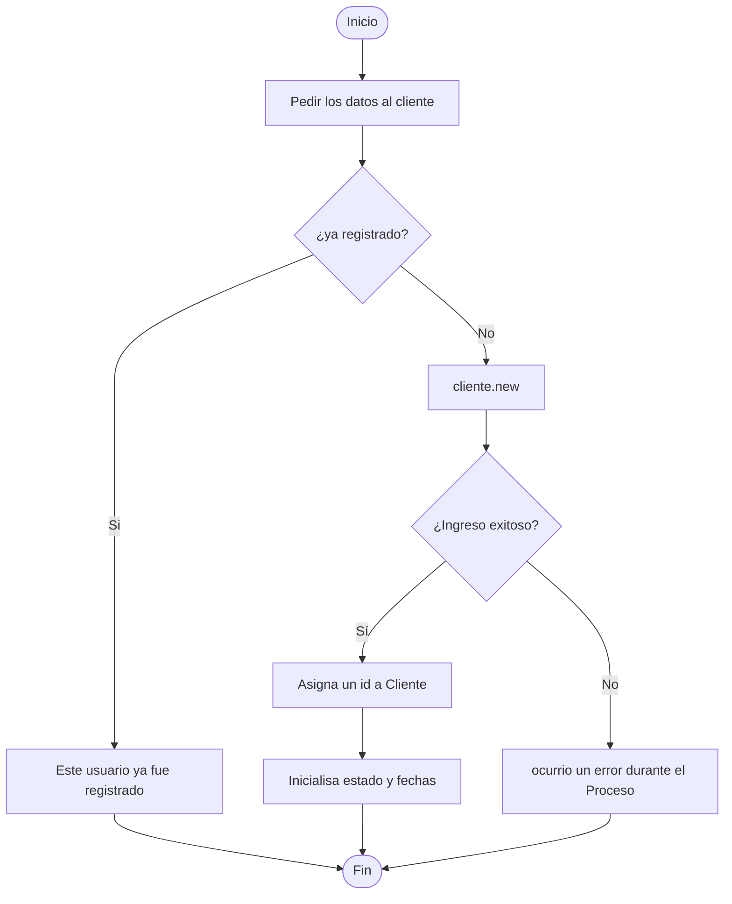

# Ingreso de nuevo cliente

```mermaid
graph TD
    A([Inicio]) --> B[Pedir los datos al cliente]
    B --> C{¿ya registrado?}
    C -->|No| D[cliente.new]
    C -->|Si| E[Este usuario ya fue registrado]
    E --> H
    D --> F{¿Ingreso exitoso?}
    F -->|Sí| G[Asigna un id a Cliente]
    F -->|No| I[ocurrio un error durante el Proceso]
    G --> J[Inicialisa estado y fechas]
    J --> H
    I --> H([Fin])
```