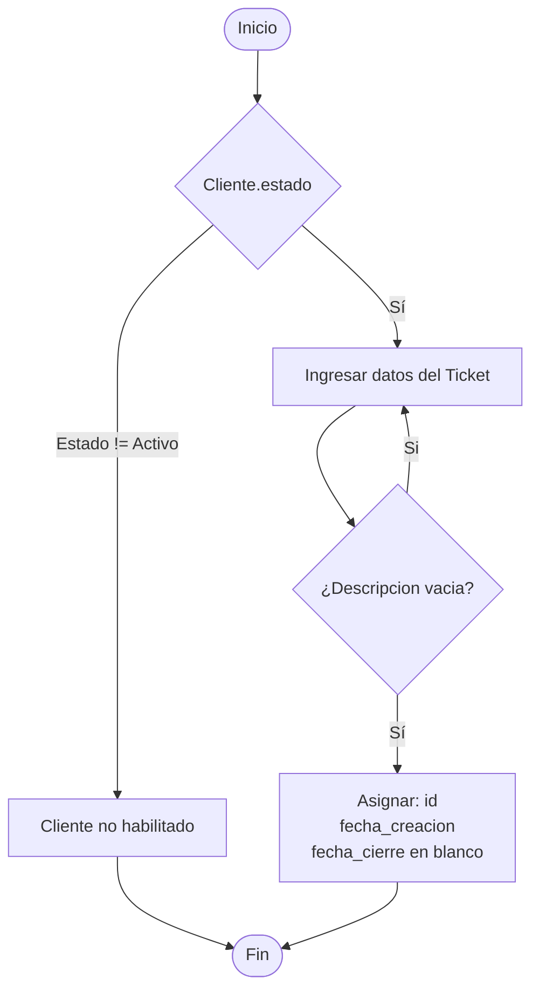

# Abrir nuevo ticket
Nota: 
Cliente ya logueado 
Inicia con ticket.new()

```mermaid
graph TD
    A([Inicio]) --> B{Cliente.estado}
    B -->|Estado != Activo| C[Cliente no habilitado]
    C --> H
    B -->|Sí| D[Ingresar datos del Ticket]
    D --> F{¿Descripcion vacia?}
    F --> |Si| D
    F -->|Sí| G[Asignar: id
                        fecha_creacion
                        fecha_cierre en blanco
]
    G --> H([Fin])
```