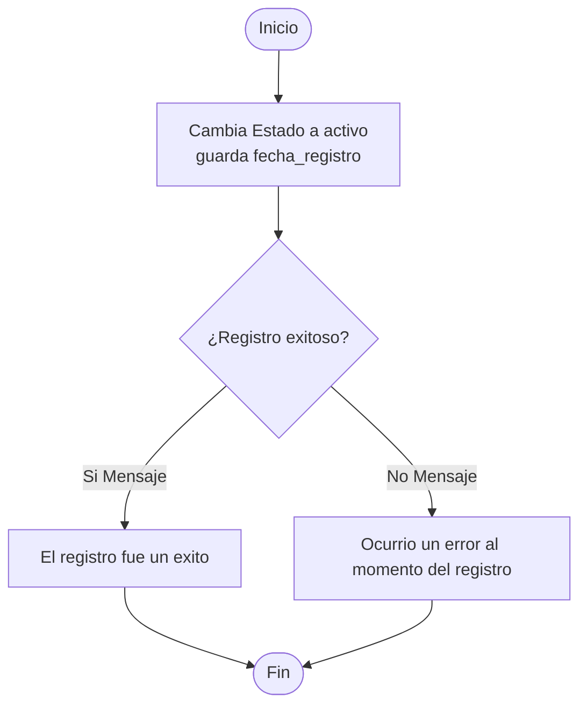

# Registro de nuevo cliente
Notas:
cliente ya ingresado
Se conoce: Id, nombre, password, CUIT, telefono, E-mail

```mermaid
graph TD
    A([Inicio]) --> B[Cambia Estado a activo
                        guarda fecha_registro
]
    B --> C{¿Registro exitoso?}
    C -->|"Si Mensaje"| D[El registro fue un exito]
    D --> H
    C -->|"No Mensaje"| E[Ocurrio un error al momento del registro]
    E --> H([Fin])
```