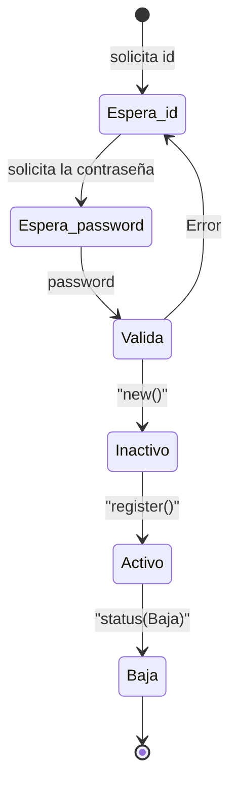

# Estado de Activo y Registrado de un Cliente

```mermaid
stateDiagram-v2
    [*] --> Espera_id: solicita id
    Espera_id --> Espera_password: solicita la contraseña
    Espera_password --> Valida: password
    Valida --> Espera_id: Error
    Valida --> Inactivo: "new()"
    Inactivo --> Activo: "register()"
    Activo --> Baja: "status(Baja)"
    Baja --> [*]
    
    
```