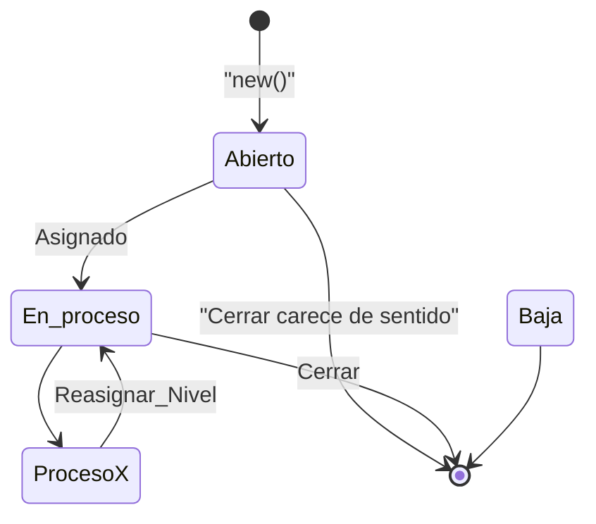

# Estado de un Ticket

```mermaid
stateDiagram-v2
    [*] --> Abierto: "new()"
    Abierto --> En_proceso: Asignado
    Abierto --> [*]: "Cerrar carece de sentido"
    ProcesoX --> En_proceso: Reasignar_Nivel
    En_proceso --> ProcesoX
    En_proceso --> [*]: Cerrar
    Baja --> [*]
```